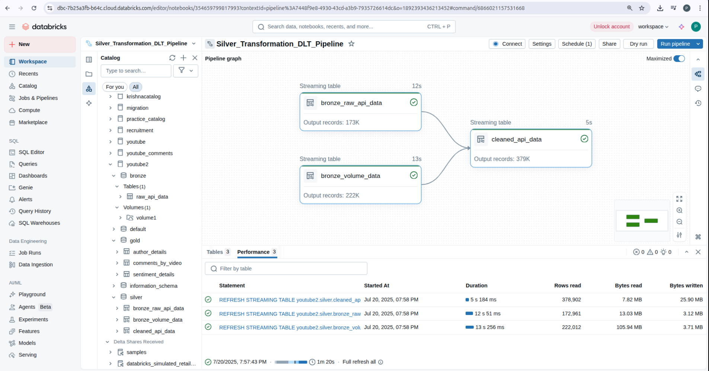

# YouTube Comments Sentiment ETL Pipeline

A **Databricks-based ETL pipeline** that ingests YouTube comment data, applies sentiment analysis, and generates curated tables for analytics. This project follows the **Medallion Architecture** (Bronze → Silver → Gold) and highlights modern data engineering practices.

---

## Summary

Gathering insights from YouTube comments can be messy: data comes in different formats, needs cleaning, and must be ready for analysis. This project:

- **Fetches** YouTube comment data via the Tellagence sentiment analysis API.  
- **Stores** raw data in the Bronze layer (Delta tables and CSV files).  
- **Cleans & merges** sources in the Silver layer using Delta Live Tables.  
- **Builds** business-friendly Gold tables for ad-hoc reporting.  

The result? A clear, maintainable pipeline that any data team can deploy and extend.

---

## Project Files

| File Name                                                                 | Description                                                                                      |
|---------------------------------------------------------------------------|--------------------------------------------------------------------------------------------------|
| **bronze_table_ingestion_fetching_data_from_sentiment_analysis_api.ipynb**       | Notebook to ingest API data into a Delta table (Bronze)                                          |
| **bronze_volume_ingestion_fetching_data_from_sentiment_analysis_api.ipynb**      | Notebook to ingest API data into CSV files on a mounted volume (Bronze)                          |
| **silver_transformation_used_for_dlt_pipeline.ipynb**                               | Delta Live Tables pipeline for cleaning and unifying Bronze sources into Silver                  |
| **gold_aggregates_for_ad_hoc_analysis.ipynb**                                         | SQL notebook to create Gold tables for comments by video, author details, and sentiment trends  |
| **sentiments_api_data.csv**                                                        | Sample raw data CSV pulled from the API                                                          |
| **DLT_Pipeline_Graph.png**                                                        | Diagram of the Silver layer Delta Live Tables pipeline                                           |
| **Streaming_DLT_Pipeline_Code_For_Silver_Layer.png**                                | Screenshot of streaming DLT code                                                                  |
| **Sentiment_Analysis_ETL_Job(End_to_End_Pipeline).png**                             | Overview of the Databricks Job orchestrating all pipeline tasks                                  |
| **[task1]bronze_table_ingestion_fetching_data_from_sentiment_analysis_api.png**    | Screenshot of the first task output                                                               |
| **[task2]bronze_volume_ingestion_fetching_data_from_sentiment_analysis_api.png**   | Screenshot of the second task output                                                              |
| **[task3_dlt_pipeline]silver_transformation_used_for_dlt_pipeline.png**            | Screenshot of the third task (DLT Silver)                                                         |
| **[task4]gold_aggregates_for_ad_hoc_analysis.png**                                 | Screenshot of the fourth task (Gold aggregates)                                                   |

---

## Architecture

This project uses the **Medallion Architecture**:

1. **Bronze (Raw)**  
   - API → Delta table  
   - API → CSV files  

2. **Silver (Clean & Enrich)**  
   - Delta Live Tables unifies and cleans streams, enforces schema.  

3. **Gold (Curated)**  
   - SQL transforms to produce tables optimized for analytics.  



---

## How to Use

1. **Clone the repo**  
   ```bash
   git clone https://github.com/your-username/youtube-comments-sentiment-etl-pipeline.git
